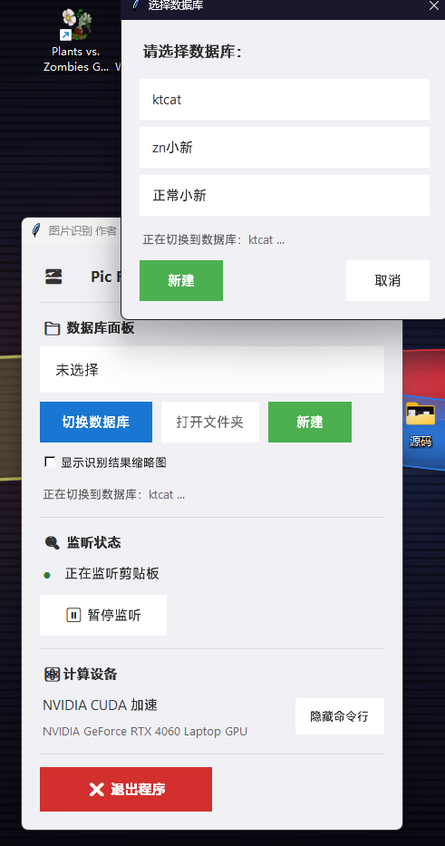
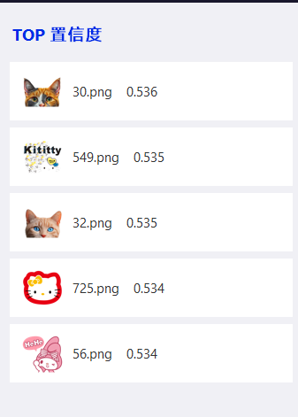

#  懒得写readme了。这是让豆包写的，注意辨别
注意这个带授权工具，你需要编译license_verify.cpp为dll。再使用生成license脚本和生成机器码脚本生成license.dat。（这些都都放在代码同文件夹了。）如果嫌麻烦你可以直接修改main.py源码跳过授权验证。
通过监听剪贴板，将框选的图片与图库比对查找。
Sticker Recognize
基于 CLIP + FAISS 的贴纸识别工具，轻量高效，支持剪贴板实时识别。
开源协议
MIT License
核心功能
支持 GPU/CPU 加速识别
批量建库 + 多数据库切换
剪贴板实时监听，复制图片即识别
识别结果可视化，一键复制名称
支持贴纸缩略图预览
部署方案（推荐虚拟环境）
1. 环境要求
Python 3.8+
可选：CUDA 11.7+（GPU 加速）
2. 搭建虚拟环境
bash
运行
# 创建虚拟环境
python -m venv venv

# 激活环境（Windows）
venv\Scripts\activate.bat  # CMD
# 或
venv\Scripts\Activate.ps1  # PowerShell

# 激活环境（Linux/macOS）
source venv/bin/activate
3. 安装依赖
bash
运行
# CPU 版本
pip install -r requirements.txt

# GPU 版本（需先装CUDA）
pip uninstall -y faiss-cpu
pip install faiss-gpu>=1.7.3 torch>=2.0.0+cu117 -f https://download.pytorch.org/whl/cu117/torch_stable.html
pip install -r requirements.txt --no-deps
4. 运行程序
bash
运行
# 启动主程序
python main.py
5. 快速使用
首次运行选择 / 新建数据库（导入贴纸文件夹）
复制贴纸图片到剪贴板
自动弹出识别结果，点击即可复制名称
注意这个带授权工具，你需要编译license_verify.cpp为dll。再使用生成license脚本和生成机器码脚本生成license.dat。（这些都都放在代码同文件夹了。）如果嫌麻烦你可以直接修改main.py源码跳过授权验证。
